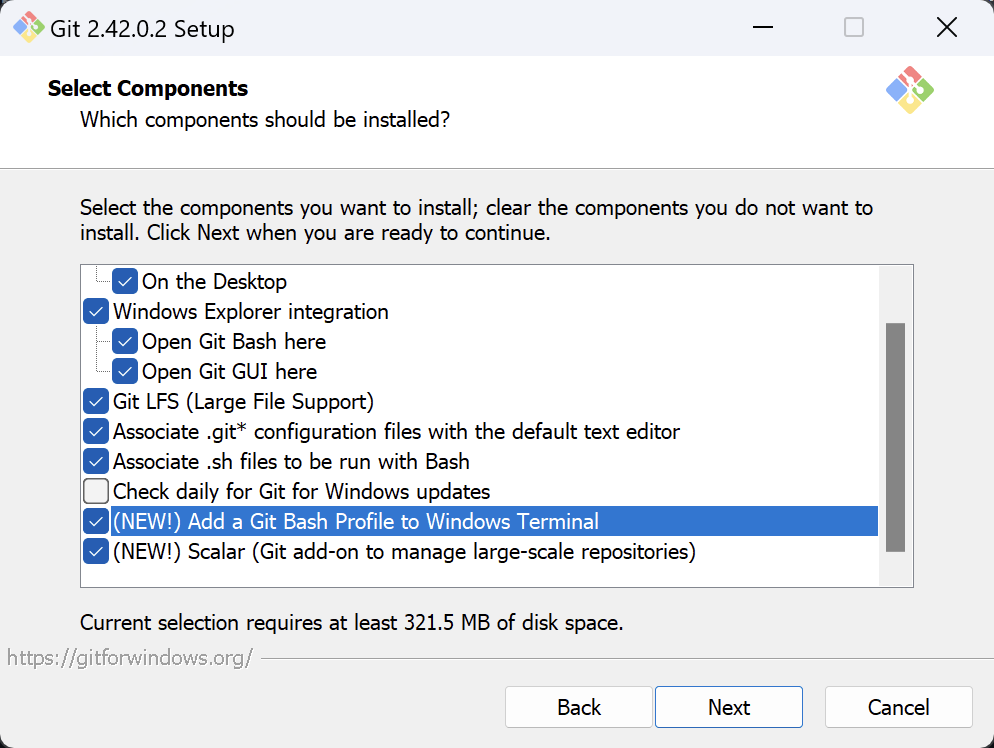
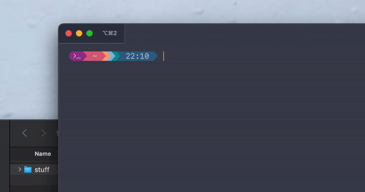
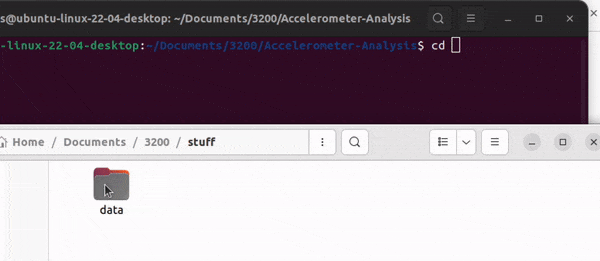
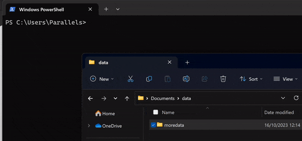
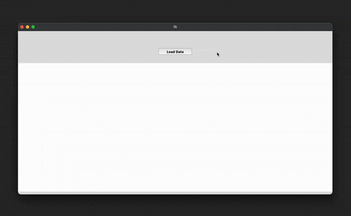
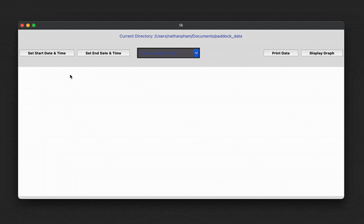
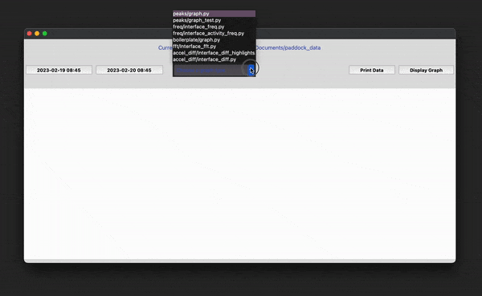
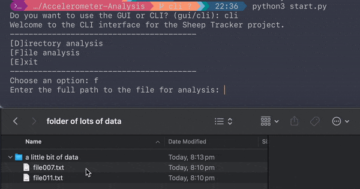

# Accelerometer data analysis and visualisation software suite
Created for CITS3200 2023 Semester 2 with love from Group 6.


## Installing prerequisites

- Windows (tested on 11), macOS (tested on 13.x Ventura and 14.x Sonoma), Linux (tested on Ubuntu 22.04.x)
- Python 3 (tested on 3.11.x)
- tkinter (for graphical interfaces)
- matplotlib (for graphing)

*Specific versions of software are not required unless specified; anything noted with an **x** can be treated as any number.*

For clarity, all terminal commands/outputs will be displayed in this format:

```bash
$ command1                  # everything after the $ can be copied safely
$ command2                  # execute AFTER previous command has successfully completed                  
output                      # expected output of above command(s)
```

### macOS

**IMPORTANT PREREQUISITE ON macOS:**

**Install homebrew package manager - it will solve MANY issues regarding packages and versions and incompatibilities.**

From https://brew.sh/

```/bin/bash -c "$(curl -fsSL https://raw.githubusercontent.com/Homebrew/install/HEAD/install.sh)"```

This will install the Homebrew package manager. Please follow its prompts!

---

**1. Ensure that Python 3.x is installed on the machine.**
In Terminal, or your favourite terminal emulator:
```bash
$ brew install python3      # will install the latest version from Homebrew, including pip
$ python3 --version
Python 3.xx.x
```

**2. Ensure next that `pip` is installed on the machine.**

```bash
$ pip3 install --upgrade pip    # install latest version, mitigate package installation issues 
$ pip3 --version                
pip 23.2.1 from [...]
```
if the above does not work, try:
```bash
$ python3 -m pip --version
pip 23.2.1 from [...]
```

**3. Ensure next that `git` is installed on the machine.**
```bash
$ brew install git                  # will install latest version of git
$ git --version
git version 2.xx.x 
```

**4. Ensure that `tkinter` is installed.**

```bash
$ brew install python-tk            # will install latest version of tkinter
```

**5. Ensure that `qt5` is installed**.

This step may take a while; `--verbose` will print out each step of the process of installation so that it is able to be verified that `qt5` is indeed installing. [For reference, on an MacBook Air 15in with Apple M2 the progress took roughly 10-20 minutes to install.]

```bash
$ pip3 install --config-settings --confirm-license= --verbose  # will install latest version of qt5
```

### Linux
In Terminal, or your favourite terminal emulator:
**1. Ensure that Python 3.x is installed on the machine.**
```bash
$ python3 --version
Python 3.xx.x
```

**2. Ensure next that `pip` is installed on the machine.**

```bash
$ pip3 --version
pip 23.2.1 from [...]
```

If `pip` is not installed:

```bash
$ sudo apt-get update && sudo apt-get upgrade -y
$ sudo apt-get install python3-pip -y
```
**3. Ensure next that `git` is installed on the machine.**
```bash
$ git --version
git version 2.3x.x
```
If `git` is not installed:

```bash
$ sudo apt-get update && sudo apt-get upgrade -y
$ sudo apt-get install git -y
```

**4. Ensure that `tkinter` is installed.**
```bash
$ sudo apt-get update && sudo apt-get upgrade -y
$ sudo apt-get install python-tk -y
```

**5. Ensure that `qt5` is installed**.

```bash
$ sudo apt-get update && sudo apt-get upgrade -y
$ sudo apt install python3-pyqt5 -y
```

### Windows
In Terminal, or your favourite terminal emulator (Command Prompt may work!):

**1. Ensure that Python 3.x is installed on the machine.**
```powershell
$ python3 --version
Python 3.xx.x
```
Note: If Python 3.x is not currently installed on the system, a Microsoft Store window will open. Install it from that window.

**2. Ensure next that `pip` is installed on the machine.**

```powershell
$ pip3 --version
pip 23.x.x from [...]
```

**3. Ensure next that `git` is installed on the machine.**

```powershell
$ git --version
git version 2.xx.x
```

If Git is not installed, install the command-line Git interface from: https://gitforwindows.org/. 

Upon installation, make sure this setting is checked:



The rest of the options can be left as default. 

**4. Ensure that `tkinter` is installed.**

Tkinter should be installed by default on Python installations on Windows.

To ensure that it does work:
```powershell
$ python3               # launch Python 3.x shell
```

```python
# in the Python shell
>>> import tkinter      # after executing, there should not be an error
>>> tkinter._test()     # should open a test window
```

**5. Ensure that `qt5` is installed**.

Procedures to install `qt5` on Windows can be found here: https://doc.qt.io/qt-5/gettingstarted.html

Please follow the steps as shown - sign up for an account and download the necessary installer for your machine(s). 

## Installing the software

### macOS

1. Create an empty folder where you would like to store the program.
2. Launch `Terminal` on your machine, and `cd` into that directory:
```bash
$ cd <path/to/dir>
```
*To make it easier, you can do this to get the folder path:*



3. Clone the repository into that folder

```bash
$ git clone https://github.com/nathanphxm/Accelerometer-Analysis
```

4. Install prerequisite Python packages

```bash
$ pip3 install -r requirements.txt
```
if the above does not work, try:
```bash
$ python3 -m pip install -r requirements.txt
```

### Linux

1. Create an empty folder where you would like to store the program.
2. Launch `Terminal` on your machine, and `cd` into that directory:
```bash
$ cd <path/to/dir>
```

*To make it easier, you can do this to get the folder path:*


3. Clone the repository into that folder
```bash
$ git clone https://github.com/nathanphxm/Accelerometer-Analysis
```
4. Install prerequisite Python packages
```bash
$ pip3 install -r requirements.txt
```

### Windows

1. Create an empty folder where you would like to store the program.
2. Launch `Terminal` on your machine, and `cd` into that directory:
```bash
$ cd <path/to/dir>
```

*To make it easier, you can do this to get the folder path:*


3. Clone the repository into that folder
```bash
$ git clone https://github.com/nathanphxm/Accelerometer-Analysis
```
4. Install prerequisite Python packages
```bash
$ pip3 install -r requirements.txt
```

## Using the software

With the application directory open in a terminal window:

```bash
$ python3 start.py
Do you want to use the GUI or CLI? (gui/cli):
```

Choose an option by typing it in the prompt. 

#### Using the graphical user interface (gui):
```bash
Do you want to use the GUI or CLI? (gui/cli): gui
```
A window will appear if all prerequisites were installed successfully.

1. Click "Load Data" and select a folder containing data to be analysed and visualised.



2. Click "Set Start Date & Time" and "Set End Date & Time" to select the timeframe and click "OK".



3. From the drop-down list, select a graph, then click "Display Graph".



4. Click "Print Data" to get the cleaned and processed .csv file for further analysis.


---

#### Using the command-line interface (cli):

```bash
Do you want to use the GUI or CLI? (gui/cli): cli
Welcome to the CLI interface for the Sheep Tracker project.
----------------------------------------
[D]irectory analysis
[F]ile analysis
[E]xit
----------------------------------------
Choose an option:
```

Choose an option by entering `d` for directory analysis, `f` for individual file analysis or `e` to exit.

---

**Entering path for analysis:**

Similar to above, you can drag in a folder or an individual file into the prompt.



If the directory exists and was read correctly, you will be prompted with:
```bash
[P]rint data to console, [E]xport data to CSV, [R]eturn to menu or e[X]it?
```

Choose an option by entering `p` to print data to console (terminal), `e` to export data to CSV, `r` to return to the main menu or `x` to exit out of the program entirely.

---

**Printing or exporting data:**

You will be prompted with:
```
[A]ccelerometer data only or [G]PS data only?
```

If printing out to console, the chosen data will pipe out into the console. This may be useful for stringing into other terminal commands!

If exporting as a .csv, the file will be found in the directory where `start.py` is located. 

---

### Troubleshooting
More often than not, if there is an issue reading the file, please check for spaces in the full file path! The program can fail if there are erroneous spaces in the file path / directory names; please consider substituting spaces for underscores or copying files to a different location for processing and analysis.


## Data visualisation details

### Activity level based on frequency of movement (interface_activity_freq.py)
[Approx running time: less than 10 seconds, if it takes longer than this, it might be an error in data file.] 

Sample graph: Activity level on cumulative frequency graph (24 hours) 

This graph show you the activity level (low, moderate, high) of sheep based on its frequency of movement per minute, in addition to a line showing its cumulative frequency for reference.

Running this code in GUI will also output a "output.csv" file containing 'Datetime', 'Frequency per Minute', 'Activity Level' for the period selected to your directory folder.

.jpeg)

Threshold values are adjustable in the python code (line 15, 16) to determine the categorisation of activity level.

Frequency threshold value is adjustable in the python code (line 19) to determine how large the difference between x(t),y(t),z(t) and x(t+1),y(t+1),z(t+1) is needed to detect a movement calculating into frequency. Frequecny will be added into that minute if either of the axes has a difference of the threshold value you set (e.g. in the sample case, is a difference of 10).


By adjusting the timeframe in GUI, you can select certain hour to visualise the data (e.g. in this case is 4 hours).

Sample graph: Activity level on cumulative frequency graph (4 hours) 
.jpeg)

### Frequency of movement per minute (interface_freq.py)
[Approx running time: less than 5 seconds, if it takes longer than this, it might be an error in data file.]

Sample graph: Frequency per minute graph (24 hours) 

This graph show you the total activity of the sheep per minute (frequency of movement), based on the difference between each movement at timestamp(0) and timestamp(1).

.png)

Frequency threshold value is adjustable in the python code (line 12) to determine how large the difference between x(t),y(t),z(t) and x(t+1),y(t+1),z(t+1) is needed to detect a movement calculating into frequency. Frequency will be added into that minute if either of the axes has a difference of the threshold value you set (e.g. in the sample case, is a difference of 10).


By adjusting the timeframe in GUI, you can select certain hour to visualise the data (e.g. in this case is 4 hours).

Sample graph: Frequency per minute graph (4 hours) 
.png)

#### Fast Fourier Transform graph (Interface_fft.py)
Runtime: around 10 seconds for 24 hour data

The following figure shows the Fast Fourier Transform graph on the X axis, Y axis, and Z axis data. The FFT plots give a rough idea of the frequency content in the signal. 

In the plot, the x-axis shows varying frequency measured in hertz and y-axis shows the amplitude of the given frequency in the data. Since the data is a time series data, the FFT plot does not give too much information on identifying pattern throughout the time of the day, and is useful just for preliminary analysis of the data to figure out distribution of frequencies intensity in a given timeframe.


#### Acceleration Difference per sample point(Interface_diff)
Runtime: around 20 second for 24 hour data

The following figure shows an acceleration difference graph for the X axis, Y axis, and Z axis data. Given the accelerometer data xi = x1, x2, .., xn. where n = length of file. The difference of x[i+1] and x[i] is calculated and plotted against the timestamps. The main aim of this plot is to reduce noise from the data, and get a better clarity on the visuals of the data points. Through this plot, a time series analysis can be observed and patterns on data can be inferred.


#### Activity highlighting through difference of acceleratioon (Interface_diff_highlights.py)
Runtime: around 1 minute for 24 hour data

Following on the acceleration difference plot, depending on the values of the difference per data point, the rows are categorised into 3 levels: "high activity", "medium activity", and "low activity". The aim of this graph is to give a clear visualisation on how intense the activities of the sheep are throughout the day. In the actual graph, there are sections colored in blue for medium activity and red for high activity. The low activity are not colored, as this over populated the graph with colors, possibly obstructing the interests of the analysis, which is finding the important times when sheep activity peaks. The graph below shows the actual plot of the highlighted graph.


The threshold of values used for the highlighting can be adjusted in the python scripts by changing the value of the global variable LOW_THRESHOLD and MEDIUM_THRESHOLD in line 12.


